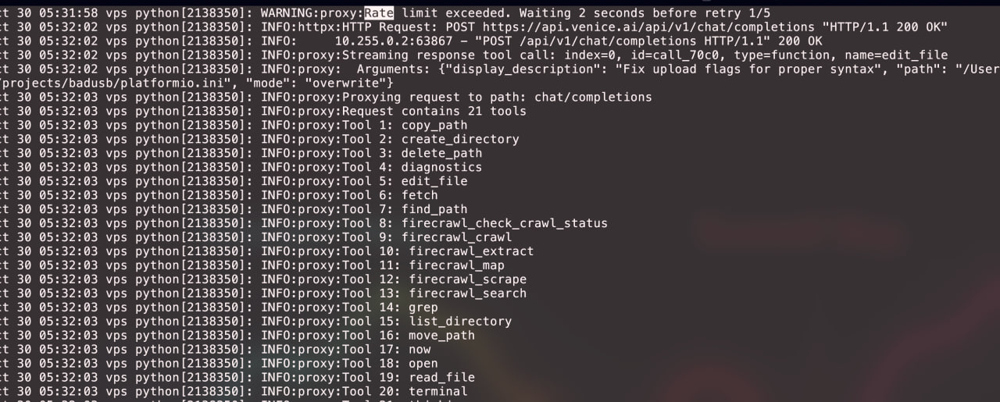

# OpenAI Proxy Server

> **⚠️ Disclaimer**: This code is AI-generated slop that has been cobbled together with varying degrees of competence. While it appears to function to a certain extent for basic use cases, it should not be considered production-ready or thoroughly tested. Use at your own risk and expect potential issues, edge cases, and general weirdness. No guarantees are made about its reliability, security, or correctness.

A FastAPI-based proxy server that acts as a middleware between OpenAI-compatible clients and the Venice.ai API. This proxy provides enhanced reliability with automatic retry logic, rate limit handling, and request/response transformation capabilities.

## Features

- **Smart Retry Logic**: Exponential backoff with configurable retry attempts for handling rate limits and temporary failures
- **Streaming Support**: Full support for Server-Sent Events (SSE) streaming responses
- **Request Transformation**: Automatically removes unsupported parameters and handles API compatibility
- **Health Monitoring**: Built-in health check endpoint for monitoring proxy status
- **Configuration Flexibility**: Environment-based configuration for easy deployment
- **Comprehensive Logging**: Detailed logging for debugging and monitoring

## Screenshot



## Quick Start

### Prerequisites

- Python 3.8 or higher
- Required Python packages (install via pip):
  ```bash
  pip install fastapi uvicorn httpx
  ```

### Installation

1. Clone or download the project
2. Navigate to the project directory
3. Install dependencies:
   ```bash
   pip install fastapi uvicorn httpx
   ```

### Running the Server

Start the proxy server with default settings:
```bash
python proxy.py
```

Or run with uvicorn directly:
```bash
uvicorn proxy:app --host 0.0.0.0 --port 9000
```

The server will start on `http://0.0.0.0:9000` by default.

## Configuration

Configure the proxy using environment variables:

| Variable | Default | Description |
|----------|---------|-------------|
| `OPENAI_BASE_URL` | `https://api.venice.ai/api/v1` | Target API endpoint |
| `PROXY_PATH_PREFIX` | `/api/v1` | Proxy path prefix |
| `TIMEOUT` | `300` | Request timeout in seconds |
| `MAX_RETRIES` | `5` | Maximum retry attempts |
| `BASE_RETRY_DELAY` | `1.0` | Base delay for exponential backoff |
| `RATE_LIMIT_WAIT` | `30` | Wait time for rate limit errors |
| `HOST` | `0.0.0.0` | Server host |
| `PORT` | `9000` | Server port |

### Example Configuration

```bash
export OPENAI_BASE_URL="https://api.venice.ai/api/v1"
export MAX_RETRIES="3"
export PORT="8080"
python proxy.py
```

## API Endpoints

### Proxy Endpoint

**URL**: `{PROXY_PATH_PREFIX}/{path:path}`
**Methods**: `GET`, `POST`, `PUT`, `DELETE`, `PATCH`, `OPTIONS`, `HEAD`

Proxies all OpenAI-compatible requests to the configured target API. Supports both regular and streaming responses.

### Health Check

**URL**: `/health`
**Method**: `GET`

Returns the health status of the proxy server and target API.

**Response Example**:
```json
{
  "status": "healthy",
  "target": "https://api.venice.ai/api/v1"
}
```

## Usage Examples

### Basic Chat Completion

```bash
curl -X POST http://localhost:9000/api/v1/chat/completions \
  -H "Content-Type: application/json" \
  -d '{
    "model": "llama-3.1-405b",
    "messages": [{"role": "user", "content": "Hello!"}]
  }'
```

### Streaming Request

```bash
curl -X POST http://localhost:9000/api/v1/chat/completions \
  -H "Content-Type: application/json" \
  -d '{
    "model": "llama-3.1-405b",
    "messages": [{"role": "user", "content": "Hello!"}],
    "stream": true
  }'
```

### Health Check

```bash
curl http://localhost:9000/health
```

## Advanced Features

### Rate Limit Handling

The proxy automatically handles 429 ( Too Many Requests) errors with:
- Exponential backoff retry logic
- Configurable retry attempts and delays
- Intelligent waiting for rate limit reset

### Request Transformation

The proxy automatically:
- Removes unsupported parameters (e.g., `prompt_cache_key`, `logprobs`, `top_logprobs`)
- Handles API path compatibility (e.g., Ollama `/api/v1/api/tags` → `/api/tags`)
- Transforms encoding formats (e.g., `base64` → `float` for embeddings)

### Error Handling

- Detailed error logging for debugging
- Graceful handling of network timeouts
- Proper HTTP status code forwarding
- Internal proxy error isolation

## Monitoring and Logging

The proxy provides comprehensive logging:
- Request path logging
- Retry attempt logging
- Error details and stack traces
- Startup configuration information

## Deployment

### Docker

```dockerfile
FROM python:3.9-slim

WORKDIR /app
COPY proxy.py .
RUN pip install fastapi uvicorn httpx

EXPOSE 9000
CMD ["python", "proxy.py"]
```

### Docker Compose

```yaml
version: '3.8'
services:
  openai-proxy:
    build: .
    ports:
      - "9000:9000"
    environment:
      - OPENAI_BASE_URL=https://api.venice.ai/api/v1
      - MAX_RETRIES=5
      - PORT=9000
```

## Security Considerations

- The proxy does not authenticate requests - consider adding authentication middleware
- API keys are passed through to the target service unchanged
- Ensure proper network security in production environments
- Monitor logs for unusual request patterns

## Troubleshooting

### Common Issues

1. **Connection Timeouts**: Increase the `TIMEOUT` environment variable
2. **Rate Limiting**: Reduce concurrent requests or increase `MAX_RETRIES`
3. **Parameter Errors**: Check that your requests use Venice.ai-compatible parameters

### Debug Mode

Enable debug logging by setting the log level:
```bash
uvicorn proxy:app --log-level debug
```

## Contributing

This is a standalone proxy server designed for Venice.ai API compatibility. Feel free to submit issues or enhancement requests.

## License

This project is provided as-is for development and testing purposes.